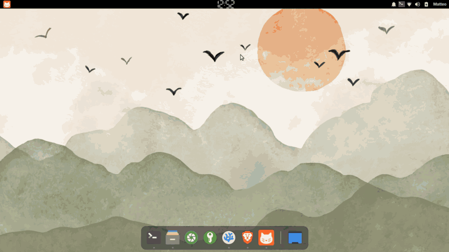

# MeowMenu: a modern and configurable XFCE application launcher

<p align="center">
  <a href="https://www.xfce.org/"></a>
  <a href="https://github.com/matteobonanomi/xfce4-meowmenu-plugin/releases"></a>
  <a href="https://github.com/matteobonanomi/xfce4-meowmenu-plugin/actions/workflows/ci.yml"></a>
  <a href="COPYING"></a>
  <a href="https://isocpp.org/"></a>
  <a href="https://www.gtk.org/"></a>
</p>



<p align="center"><strong><a href="https://github.com/matteobonanomi/xfce4-meowmenu-plugin/releases">Releases</a></strong> | <strong><a href="docs/index.md">Documentation</a></strong> | <strong><a href="https://aur.archlinux.org/packages/xfce4-meowmenu-plugin">AUR</a></strong></p>

MeowMenu is a native Xfce panel launcher and a standalone fork of
[Whisker Menu](https://gitlab.xfce.org/panel-plugins/xfce4-whiskermenu-plugin).
It adds saved presets, Places integration, flexible docked, centered, and
full-screen layouts, drag-and-drop actions, and an optional inline Calculator
while keeping a familiar launcher workflow.

It is fully keyboard-driven: Tab switches Applications and Places, Ctrl+Tab
moves among areas, and the arrow keys navigate results. See
[keyboard navigation](docs/keyboard-navigation.md).

## Install

Release packages are provided for Ubuntu 26.04, Debian 13, and Fedora 44.
Arch users can use the separately maintained
[AUR package](https://aur.archlinux.org/packages/xfce4-meowmenu-plugin).
Follow the [installation guide](docs/installation.md) for package commands,
dependencies, source builds, removal, and full cleanup.

After installation, restart the panel with `xfce4-panel -r`, then add
**MeowMenu** through **Add New Items**.

## Release-candidate support

MeowMenu 1.0.0-rc1 publishes package candidates for Ubuntu 26.04, Debian 13,
and Fedora 44. Arch is a separately maintained source recipe rather than a
prebuilt project package.

Continuous source builds cover the Xfce 4.16, 4.18, and 4.20 library
generations. Xfce 4.20 on X11 and `x86_64`/`amd64` remains the primary live
quality target. The libxfce4ui 4.21-or-newer replacement path is staged and
tested without Exo, but is not presented as a separately live-validated
desktop release. Wayland remains unverified live and gracefully disables
optional positioning support when it is unavailable.

- [Release-specific support and evidence](docs/support.md)
- [Known limitations](docs/known-limitations.md)
- [Five-minute test and upgrade checks](docs/testing.md)
- [Translation status](docs/translations.md)

## Build from source

Install the dependencies in the
[source-build guide](docs/installation.md#build-from-source), then run:

```bash
git clone https://github.com/matteobonanomi/xfce4-meowmenu-plugin.git
cd xfce4-meowmenu-plugin
meson setup build
meson compile -C build
meson test -C build --print-errorlogs
sudo meson install -C build
```

## Configure

Right-click the panel button and choose **Properties**. Four built-in presets
ship with MeowMenu: Classic, Modern, Full Screen, and Minimal. Settings live in
Xfconf and can be changed through the graphical preferences. See the
[preset guide](docs/presets.md) and
[configuration reference](docs/configuration.md).

## Contribute and report

- [Contributing guide](CONTRIBUTING.md)
- [Ordinary bug reports](https://github.com/matteobonanomi/xfce4-meowmenu-plugin/issues/new?template=bug-report.yml)
- [Compatibility reports](https://github.com/matteobonanomi/xfce4-meowmenu-plugin/issues/new?template=compatibility-report.yml)
- [Security policy](.github/SECURITY.md)
- [Translation review](docs/translations.md)

MeowMenu includes 56 gettext catalogs. Technical validity, completeness,
provenance, and fluent review are reported separately; reviews by fluent
speakers are welcome.

## License and credits

MeowMenu is distributed under the [GNU General Public License v2](COPYING), or
any later version. Original Whisker Menu was created by Graeme Gott; its
[source remains available from Xfce](https://gitlab.xfce.org/panel-plugins/xfce4-whiskermenu-plugin).

AI coding agents assisted with selected translations, hardening and refactoring,
and documentation consistency checks. Every change is maintainer-reviewed.
