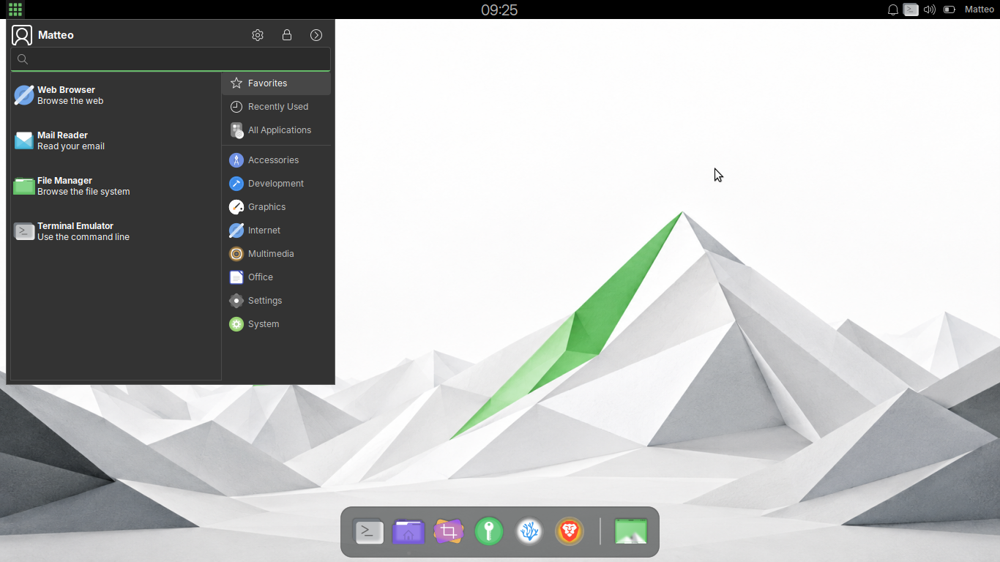
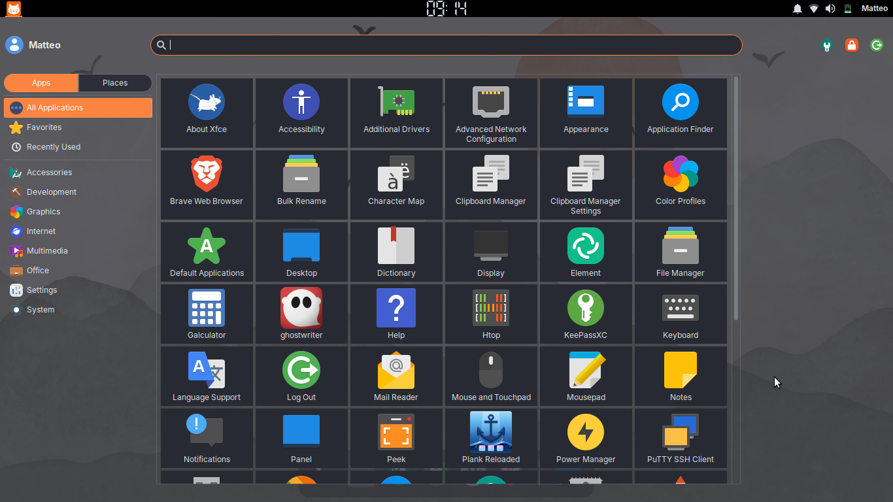
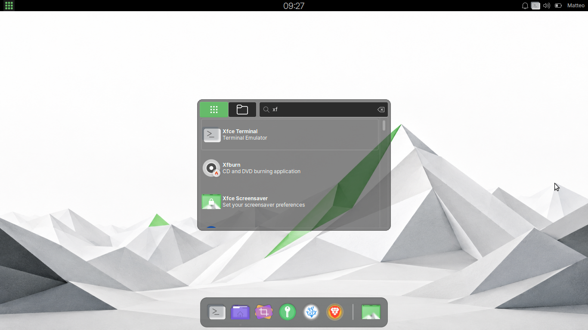

# Presets

A preset is a `.meowpreset` snapshot of the menu's visual and layout settings.
Selecting one changes the menu immediately.

In Docked and Centered layouts, every preset uses the active GTK theme to
distinguish category and auxiliary chrome from the Search and Results content
surface. Major-region spacing follows the same theme-derived rhythm, and the
Results view and scrollbar trough remain frameless. Full Screen intentionally
keeps one uniform surface.

A fresh installation starts on the **Modern** preset. The first start after
upgrading a pre-1.0 instance also resets that instance to Modern and removes
its GUI-managed custom presets. See the
[installation recovery guidance](installation#one-time-reset-when-upgrading-pre-10-installations)
before upgrading.

## Selecting a built-in preset is a full reset

Choosing a built-in preset restores all of its settings, including Calculator
defaults. Selecting it again, or using **Reset preset**, reapplies it. Later
changes create an unsaved custom state; built-in presets never change.

## Built-in presets

### Classic



Traditional compact launcher look. Its primary row is at the top with Profile
and Session shown. The docked window uses an application list, a right sidebar,
square corners, and a fully solid background (menu opacity 100%). The
Apps/Places switch uses text labels.


### Modern


Contemporary docked layout with its primary row at the top, Profile and Session
shown, rounded corners, a left sidebar, a fully solid background (menu opacity
100%), hover-to-switch-category, and Places enabled. The Apps/Places switch
uses icon buttons.


### Full Screen



Launcher fills the entire screen over a translucent backdrop (menu opacity
80%). The single primary row stays at the top with Profile and Session shown.
Ideal for touch or keyboard-first workflows. Places is enabled, and the left
category sidebar uses Small (32 px) icons. The Apps/Places switch uses text
labels.


### Minimal



A compact, distraction-free launcher: a search bar over an app list, with no
sidebar, Profile, or Session controls. Opens centred on screen in a
short window with a lightly translucent background (menu opacity 60%), Places
enabled with icons, opening on the Recent category. Switch to any other built-in
to bring the sidebar, Profile, and Session controls back.

Calculator defaults are **None / Auto / 4** for Classic and **bc / Auto / 4**
for Modern, Full Screen, and Minimal. The Apps/Places switch uses icons in
Modern and Minimal, and text labels in Classic and Full Screen.

All presets use the same trackless Apps/Places presentation: two equal choices
with one selected mode and GTK-native interaction feedback. Icon sizes follow
the selector's current sidebar, Search, or Session host. Text choices keep
their natural height for translated labels and enlarged text.

When Places is active in a vertical sidebar, Home, History, and Favourites
start at the application list's top anchor. No divider follows Favourites when
there is no lower group, and the three navigation icons share an aligned,
optically consistent presentation across presets.

## The Unsaved custom state

Changing a governed setting shows **Unsaved custom** in **Properties → General**.
Restore every value to return to the preset name, or choose another preset to
discard the changes. The field always shows a preset name or **Unsaved custom**.

## How the dropdown reads at a glance

- **Built-in** presets are bold.
- **Saved custom** presets use regular weight.
- **Unsaved custom** is italic.

## Saving, renaming, deleting

**Properties → General** manages custom presets:

- **Save as new…** saves the current layout under a unique name.
- **Rename…** renames the selected custom preset.
- **Delete** removes it; deleting the active preset restores **Modern**.

Built-in presets cannot be renamed, deleted, or exported — those actions are
available only for your own saved presets.

## Exporting and importing

- **Export…** writes a selected custom preset to a `.meowpreset` file.
- **Import…** can overwrite or rename a clashing custom preset. A built-in name
  can only be renamed.

Imports ignore unknown non-layout settings and use defaults for omitted ones.
A preset containing retired layout settings, including a Top or Bottom sidebar,
is incompatible and is rejected before conflict handling or any saved value is
changed. Invalid or unreadable files are also rejected without changing saved
presets.

## Advanced: hand-authored preset files

You can also write a preset with `[Preset]` and `[Settings]` sections:

```ini
[Preset]
Name=My Custom Preset
SchemaVersion=1
Id=my-custom
Description=My preset

[Settings]
layout-mode=docked
corner-radius=8
search-bar-position=top
show-profile=true
show-session=true
sidebar-enabled=true
sidebar-position=horizontal
```

Save the file as `<id>.meowpreset` (the filename stem must match the `Id`
field). Then place it in:

```
~/.local/share/meowmenu/presets/
```

Restart the panel with `xfce4-panel -r` to see it in
**Properties → General → Preset**. A matching built-in `Id` overrides the
system preset. Unknown keys are ignored; malformed files are skipped.
