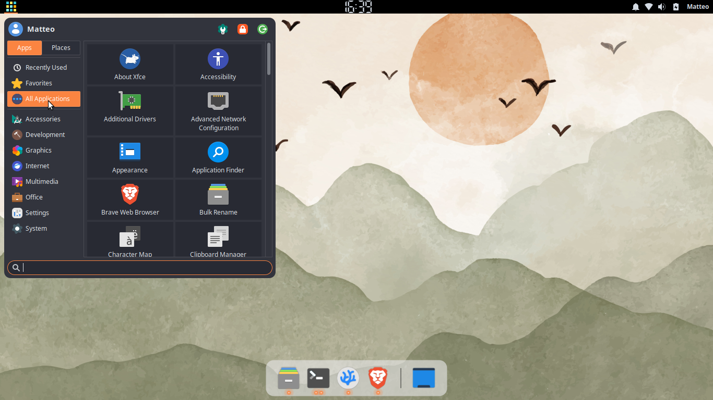

# Presets

A preset is a snapshot of all visual and layout settings saved as a plain
`.meowpreset` file. Switching presets reshapes the menu instantly — size,
corner radius, icon style, sidebar position, and more — without touching
individual options.

## Built-in presets

### Classic

<!-- preset-classic.png not yet available -->

Traditional Whisker Menu look. Compact docked window, apps as a list,
sidebar on the right, no rounded corners. The Apps/Places switch uses text
labels.

### Modern



Contemporary layout with rounded corners, opacity, hover-to-switch-category,
and Places search enabled. The Apps/Places switch uses icon buttons.

### Full Screen

<!-- preset-fullscreen.png not yet available -->

Launcher fills the entire screen. Ideal for touch or keyboard-first
workflows. Places search enabled. The Apps/Places switch uses text labels.

Each preset sets its own default for the Apps/Places **Show icons** option
(Modern on; Classic and Full Screen off). Switching presets updates the
default, but your own later changes to the option always win.

## Custom presets

To create a custom preset, write a plain text file with a `[Preset]` header
block and a `[Settings]` block containing the desired keys:

```ini
[Preset]
Name=My Custom Preset
SchemaVersion=1
Id=my-custom
Description=My preset

[Settings]
layout-mode=docked
corner-radius=8
```

Save the file as `<id>.meowpreset` (the filename stem must match the `Id`
field). Then place it in:

```
~/.local/share/meowmenu/presets/
```

Restart the panel with `xfce4-panel -r`. The preset will appear in
**Properties → General → Preset**.

A file whose `Id` matches a built-in preset overrides the system version.

## File format

```ini
[Preset]
Name=My Custom Preset
SchemaVersion=1
Id=my-custom
Description=My preset

[Settings]
layout-mode=docked
corner-radius=8
```

Unknown keys are silently ignored. Malformed files are skipped without
crashing the panel.
